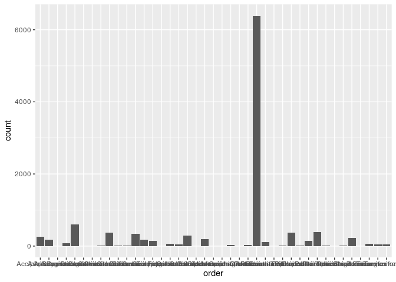

Lab 3 Report
================
*Haider*
2021-02-02

Instructions for this lab report can be found on [Your assignment
section of Lab Assignment 3 Introduction to
ggplot2](https://biol275-msum.github.io/introduction-to-ggplot2.html#your-assignment)
on the lab website.

## Fireflies

> A. Insert an R code chunk and create a graph depicting the frequency
> distribution of the 35 mass measurements. It should have legible text
> and appropriate axis labels.

``` r
# load packages -----------------------------------------------------------

library(tidyverse)
```

    ## ── Attaching packages ─────────────────────────────────────── tidyverse 1.3.0 ──

    ## ✓ ggplot2 3.3.3     ✓ purrr   0.3.4
    ## ✓ tibble  3.0.5     ✓ dplyr   1.0.3
    ## ✓ tidyr   1.1.2     ✓ stringr 1.4.0
    ## ✓ readr   1.4.0     ✓ forcats 0.5.0

    ## ── Conflicts ────────────────────────────────────────── tidyverse_conflicts() ──
    ## x dplyr::filter() masks stats::filter()
    ## x dplyr::lag()    masks stats::lag()

``` r
# Fireflies ---------------------------------------------------------------

fireflies_data <- read_csv("https://whitlockschluter.zoology.ubc.ca/wp-content/data/chapter02/chap02q19FireflySpermatophoreMass.csv")
```

    ## 
    ## ── Column specification ────────────────────────────────────────────────────────
    ## cols(
    ##   spermatophoreMass = col_double()
    ## )

``` r
fireflies_data
```

    ## # A tibble: 35 x 1
    ##    spermatophoreMass
    ##                <dbl>
    ##  1             0.047
    ##  2             0.037
    ##  3             0.041
    ##  4             0.045
    ##  5             0.039
    ##  6             0.064
    ##  7             0.064
    ##  8             0.065
    ##  9             0.079
    ## 10             0.07 
    ## # … with 25 more rows

``` r
distinct(fireflies_data, spermatophoreMass)
```

    ## # A tibble: 26 x 1
    ##    spermatophoreMass
    ##                <dbl>
    ##  1             0.047
    ##  2             0.037
    ##  3             0.041
    ##  4             0.045
    ##  5             0.039
    ##  6             0.064
    ##  7             0.065
    ##  8             0.079
    ##  9             0.07 
    ## 10             0.066
    ## # … with 16 more rows

``` r
count(fireflies_data, spermatophoreMass)
```

    ## # A tibble: 26 x 2
    ##    spermatophoreMass     n
    ##  *             <dbl> <int>
    ##  1             0.037     1
    ##  2             0.039     1
    ##  3             0.041     1
    ##  4             0.045     1
    ##  5             0.046     1
    ##  6             0.047     1
    ##  7             0.048     2
    ##  8             0.055     1
    ##  9             0.056     1
    ## 10             0.059     1
    ## # … with 16 more rows

``` r
ggplot(data = fireflies_data)
```

<!-- -->

``` r
ggplot(data = fireflies_data) +
  geom_bar(mapping = aes(x = spermatophoreMass))
```

<!-- -->

``` r
ggplot(data = fireflies_data) +
  geom_bar(mapping = aes(x = spermatophoreMass), fill = "#C5351B") +
  labs(x = "spermatophore mass(g)", y = "Frequency ")
```

<!-- -->

``` r
ggplot(data = fireflies_data) +
  geom_bar(mapping = aes(x = spermatophoreMass), fill = "#C5351B", 
           width = 0.001) +
  labs(x = "spermatophore mass(g)", y = "Frequency") +
  scale_y_continuous(limits = c(0, 5), expand = expansion(mult = 0)) +
  theme_classic(base_size = 12) +
  theme(
    axis.title = element_text(face = "bold"),
    axis.text = element_text(color = "black", size = rel(1)),
    axis.text.x = element_text(angle = 45, hjust = 1),
    axis.ticks.x = element_blank()
  )
```

<!-- -->

> B. What type of graph did you choose in part (A)? Why?

\_\_\_Bar Graph The values were more legible in bar graph and it was
more feasible and easy to customize the graph accordingly.

> C. Describe the shape of the frequency distribution. What are its main
> features?

\_\_\_The shape is right skewed and has an outlier towards at right.

> D. What term would be used to describe the largest measurement in the
> frequency distribution? You can refer to the lecture slides, your
> notes, or the textbook.

\_\_\_Mode is the largest measurement in the frequency table.

## Bird orders

I read the data using the code provided by the instructor. The dataset
is from the auk package and was originally named ebird\_taxonomy. I
converted it to a tibble, removed non-species taxa, and named the new
dataset birds.

``` r
library(auk)                          # load the auk package
```

    ## auk 0.4.2 is designed for EBD files downloaded after 2019-08-15. 
    ## No EBD data directory set, see ?auk_set_ebd_path to set EBD_PATH 
    ## eBird taxonomy version:  2019

``` r
library(tidyverse)
birds <- ebird_taxonomy %>%           # start with the ebird_taxonomy data
  as_tibble() %>%                     # tibbles print better in the console
  filter(category == "species")       # remove non-species taxa
```

> E. How many bird species are in the new birds dataset? How did you
> find out?

The bird species were found out to be 10721. Found it from the data
table by counting the number of rows.

> H. How many orders are there? You can get this right by counting on
> the graph, but you will only get full points if you use some code to
> figure it out.

41 Found it from running the code count(birds,order)

> F. Insert an R code chunk and create a graph depicting the
> distribution of orders in the birds dataset. Sort the orders with the
> most frequent on the left. It should have legible text and appropriate
> axis labels.

``` r
# load packages -----------------------------------------------------------

library(auk)                          # load the auk package
library(tidyverse)

# Birds -------------------------------------------------------------------

birds <- ebird_taxonomy %>%           # start with the ebird_taxonomy data
  as_tibble() %>%                     # tibbles print better in the console
  filter(category == "species")       # remove non-species taxa

birds
```

    ## # A tibble: 10,721 x 9
    ##    species_code scientific_name common_name order family family_common category
    ##    <chr>        <chr>           <chr>       <chr> <chr>  <chr>         <chr>   
    ##  1 ostric2      Struthio camel… Common Ost… Stru… Strut… Ostriches     species 
    ##  2 ostric3      Struthio molyb… Somali Ost… Stru… Strut… Ostriches     species 
    ##  3 grerhe1      Rhea americana  Greater Rh… Rhei… Rheid… Rheas         species 
    ##  4 lesrhe2      Rhea pennata    Lesser Rhea Rhei… Rheid… Rheas         species 
    ##  5 tabtin1      Nothocercus ju… Tawny-brea… Tina… Tinam… Tinamous      species 
    ##  6 higtin1      Nothocercus bo… Highland T… Tina… Tinam… Tinamous      species 
    ##  7 hootin1      Nothocercus ni… Hooded Tin… Tina… Tinam… Tinamous      species 
    ##  8 grytin1      Tinamus tao     Gray Tinam… Tina… Tinam… Tinamous      species 
    ##  9 soltin1      Tinamus solita… Solitary T… Tina… Tinam… Tinamous      species 
    ## 10 blatin1      Tinamus osgoodi Black Tina… Tina… Tinam… Tinamous      species 
    ## # … with 10,711 more rows, and 2 more variables: taxon_order <dbl>,
    ## #   report_as <chr>

``` r
distinct(birds,order)
```

    ## # A tibble: 41 x 1
    ##    order              
    ##    <chr>              
    ##  1 Struthioniformes   
    ##  2 Rheiformes         
    ##  3 Tinamiformes       
    ##  4 Casuariiformes     
    ##  5 Apterygiformes     
    ##  6 Anseriformes       
    ##  7 Galliformes        
    ##  8 Phoenicopteriformes
    ##  9 Podicipediformes   
    ## 10 Columbiformes      
    ## # … with 31 more rows

``` r
count(birds, order)
```

    ## # A tibble: 41 x 2
    ##    order                n
    ##  * <chr>            <int>
    ##  1 Accipitriformes    252
    ##  2 Anseriformes       178
    ##  3 Apterygiformes       5
    ##  4 Bucerotiformes      72
    ##  5 Caprimulgiformes   597
    ##  6 Cariamiformes        2
    ##  7 Casuariiformes       4
    ##  8 Cathartiformes       7
    ##  9 Charadriiformes    379
    ## 10 Ciconiiformes       19
    ## # … with 31 more rows

``` r
ggplot(data = birds)
```

<!-- -->

``` r
ggplot(data = birds) +
  geom_bar(mapping = aes(x = order))
```

<!-- -->

``` r
ggplot(data = birds) +
  geom_bar(mapping = aes(x = fct_infreq(order)))
```

<!-- -->

``` r
ggplot(data = birds) +
  geom_bar(mapping = aes(x = fct_infreq(order)), fill = "#C5351B")
```

<!-- -->

``` r
ggplot(data = birds) +
  geom_bar(mapping = aes(x = fct_infreq(order)), fill = "#C5351B") +
  labs(x = "Order", y = "Frequency ")
```

<!-- -->

``` r
ggplot(data = birds) +
  geom_bar(mapping = aes(x = fct_infreq(order)), fill = "#C5351B", 
           width = 0.8) +
  labs(x = "Order", y = "Frequency ") +
  scale_y_continuous( expand = expansion(mult = 0)) +
  theme_classic(base_size = 10) +
  theme(
    axis.title = element_text(face = "bold"),
    axis.text = element_text(color = "black", size = rel(1)),
    axis.text.x = element_text(angle = 45, hjust = 1),
    axis.ticks.x = element_blank()
  )
```

<!-- -->

> G. What kind of graph did you create? Why?

\_\_\_ Bar Graph The values were more legible in bar graph and it was
more feasible and easy to customize the graph accordingly.

## Links to peer review

I reviewed \_\_\_’s lab report at this URL: \_\_\_

\_\_\_ reviewed my lab report at this URL: \_\_\_

## Session Info

Here is my session information:

``` r
sessioninfo::session_info()
```

    ## Warning in system("timedatectl", intern = TRUE): running command 'timedatectl'
    ## had status 1

    ## ─ Session info ───────────────────────────────────────────────────────────────
    ##  setting  value                       
    ##  version  R version 4.0.3 (2020-10-10)
    ##  os       Ubuntu 16.04.7 LTS          
    ##  system   x86_64, linux-gnu           
    ##  ui       X11                         
    ##  language (EN)                        
    ##  collate  C.UTF-8                     
    ##  ctype    C.UTF-8                     
    ##  tz       Etc/UTC                     
    ##  date     2021-02-02                  
    ## 
    ## ─ Packages ───────────────────────────────────────────────────────────────────
    ##  package     * version date       lib source        
    ##  assertthat    0.2.1   2019-03-21 [1] RSPM (R 4.0.3)
    ##  auk         * 0.4.3   2020-11-23 [1] RSPM (R 4.0.3)
    ##  backports     1.2.1   2020-12-09 [1] RSPM (R 4.0.3)
    ##  broom         0.7.3   2020-12-16 [1] RSPM (R 4.0.3)
    ##  cellranger    1.1.0   2016-07-27 [1] RSPM (R 4.0.3)
    ##  cli           2.2.0   2020-11-20 [1] RSPM (R 4.0.3)
    ##  colorspace    2.0-0   2020-11-11 [1] RSPM (R 4.0.3)
    ##  crayon        1.3.4   2017-09-16 [1] RSPM (R 4.0.3)
    ##  curl          4.3     2019-12-02 [1] RSPM (R 4.0.3)
    ##  DBI           1.1.1   2021-01-15 [1] RSPM (R 4.0.3)
    ##  dbplyr        2.0.0   2020-11-03 [1] RSPM (R 4.0.3)
    ##  digest        0.6.27  2020-10-24 [1] RSPM (R 4.0.3)
    ##  dplyr       * 1.0.3   2021-01-15 [1] RSPM (R 4.0.3)
    ##  ellipsis      0.3.1   2020-05-15 [1] RSPM (R 4.0.3)
    ##  evaluate      0.14    2019-05-28 [1] RSPM (R 4.0.3)
    ##  fansi         0.4.2   2021-01-15 [1] RSPM (R 4.0.3)
    ##  farver        2.0.3   2020-01-16 [1] RSPM (R 4.0.3)
    ##  forcats     * 0.5.0   2020-03-01 [1] RSPM (R 4.0.3)
    ##  fs            1.5.0   2020-07-31 [1] RSPM (R 4.0.3)
    ##  generics      0.1.0   2020-10-31 [1] RSPM (R 4.0.3)
    ##  ggplot2     * 3.3.3   2020-12-30 [1] RSPM (R 4.0.3)
    ##  glue          1.4.2   2020-08-27 [1] RSPM (R 4.0.3)
    ##  gtable        0.3.0   2019-03-25 [1] RSPM (R 4.0.3)
    ##  haven         2.3.1   2020-06-01 [1] RSPM (R 4.0.3)
    ##  hms           1.0.0   2021-01-13 [1] RSPM (R 4.0.3)
    ##  htmltools     0.5.1.1 2021-01-22 [1] RSPM (R 4.0.3)
    ##  httr          1.4.2   2020-07-20 [1] RSPM (R 4.0.3)
    ##  jsonlite      1.7.2   2020-12-09 [1] RSPM (R 4.0.3)
    ##  knitr         1.30    2020-09-22 [1] RSPM (R 4.0.3)
    ##  labeling      0.4.2   2020-10-20 [1] RSPM (R 4.0.3)
    ##  lifecycle     0.2.0   2020-03-06 [1] RSPM (R 4.0.3)
    ##  lubridate     1.7.9.2 2020-11-13 [1] RSPM (R 4.0.3)
    ##  magrittr      2.0.1   2020-11-17 [1] RSPM (R 4.0.3)
    ##  modelr        0.1.8   2020-05-19 [1] RSPM (R 4.0.3)
    ##  munsell       0.5.0   2018-06-12 [1] RSPM (R 4.0.3)
    ##  pillar        1.4.7   2020-11-20 [1] RSPM (R 4.0.3)
    ##  pkgconfig     2.0.3   2019-09-22 [1] RSPM (R 4.0.3)
    ##  purrr       * 0.3.4   2020-04-17 [1] RSPM (R 4.0.3)
    ##  R6            2.5.0   2020-10-28 [1] RSPM (R 4.0.3)
    ##  Rcpp          1.0.6   2021-01-15 [1] RSPM (R 4.0.3)
    ##  readr       * 1.4.0   2020-10-05 [1] RSPM (R 4.0.3)
    ##  readxl        1.3.1   2019-03-13 [1] RSPM (R 4.0.3)
    ##  reprex        0.3.0   2019-05-16 [1] RSPM (R 4.0.3)
    ##  rlang         0.4.10  2020-12-30 [1] RSPM (R 4.0.3)
    ##  rmarkdown     2.6     2020-12-14 [1] RSPM (R 4.0.3)
    ##  rstudioapi    0.13    2020-11-12 [1] RSPM (R 4.0.3)
    ##  rvest         0.3.6   2020-07-25 [1] RSPM (R 4.0.3)
    ##  scales        1.1.1   2020-05-11 [1] RSPM (R 4.0.3)
    ##  sessioninfo   1.1.1   2018-11-05 [1] RSPM (R 4.0.3)
    ##  stringi       1.5.3   2020-09-09 [1] RSPM (R 4.0.3)
    ##  stringr     * 1.4.0   2019-02-10 [1] RSPM (R 4.0.3)
    ##  tibble      * 3.0.5   2021-01-15 [1] RSPM (R 4.0.3)
    ##  tidyr       * 1.1.2   2020-08-27 [1] RSPM (R 4.0.3)
    ##  tidyselect    1.1.0   2020-05-11 [1] RSPM (R 4.0.3)
    ##  tidyverse   * 1.3.0   2019-11-21 [1] RSPM (R 4.0.3)
    ##  utf8          1.1.4   2018-05-24 [1] RSPM (R 4.0.3)
    ##  vctrs         0.3.6   2020-12-17 [1] RSPM (R 4.0.3)
    ##  withr         2.4.0   2021-01-16 [1] RSPM (R 4.0.3)
    ##  xfun          0.20    2021-01-06 [1] RSPM (R 4.0.3)
    ##  xml2          1.3.2   2020-04-23 [1] RSPM (R 4.0.3)
    ##  yaml          2.2.1   2020-02-01 [1] RSPM (R 4.0.3)
    ## 
    ## [1] /home/rstudio-user/R/x86_64-pc-linux-gnu-library/4.0
    ## [2] /opt/R/4.0.3/lib/R/library
